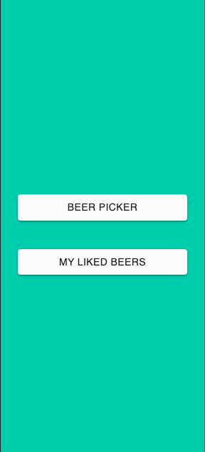
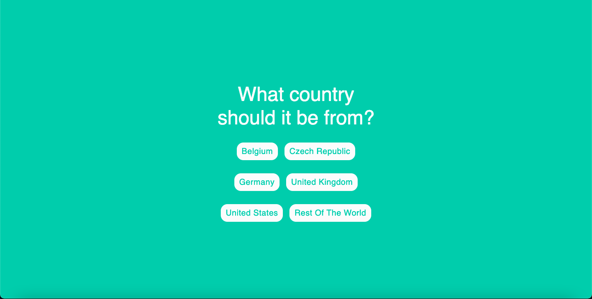

# Uruchamianie projektu:

Aby uruchomić projekt naley sklonować repozytorium lub pobrać kod źródłowy.
Przy pomocy narzędzia **Docker** oraz polecenia _docker-compose up_ (wywołanego w głównym katalogu projektu).
Aplikacja uruchomiona zostanie na lokalnym serwerze na porcie 3000.
Aby z niej skorzystać, w oknie przeglądarki należy wpisać _http://localhost:3000_

# Opis projektu

Aplikacja Drink Up została stworzona z pasji do piwa kraftowego.
Jest odpowiedzią na problem wielu beergeeków, którzy wiedzą, że chcą napić się ulubionego trunku, jednak nie wiedzą jaki styl piwa wybrać. Główną funkcjonalnością jest **BEER PICKER**, czyli kilka prostych pytań na temat cech piwa, po których aplikacja zwraca proponowane piwo, którego cechy pasują do odpowiedzi użytkownika.

Aplikacja składa się z następujących ekranów:

## Ekran logowania

Do zalogowania się wymagany jest email oraz hasło

## Ekran rejestracji

Do rejestracji wymagany jest email i hasło, opcjonalną opcją jest nazwa użytkownika

## Ekran główny

W ekranie głównym jest możliwość przejścia do **BEER PICKERA** lub do polubionych przez użytkownika piw (funkcjonalność jeszcze niedostępna, w planach jest dalsze jej rozwijanie)

## Ekran wyświetlania wyników

W tym ekranie po wysłaniu pytań, aplikacja zwraca nazwę stylu proponowanego piwa oraz link do przeglądarki Google, dzięki któremu użytkownik może lepiej poznać dany styl.

# Zrzuty ekranu

